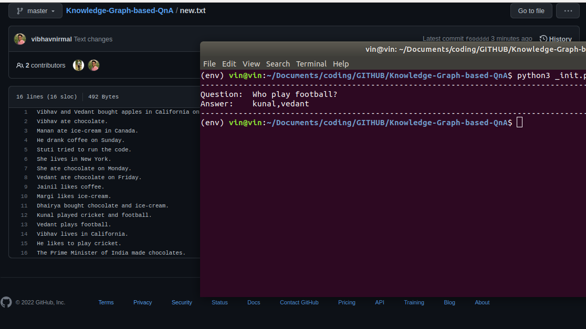

# Knowledge-Graph-based-QnA

Our objectives of the project can be outlined as:

1. To implement different, novel approaches to intelligent question answering system
2. To study different approaches in order to generate the best cases under which one method outperforms another
3. To solve queries and answer questions efficiently from a given context

Our approach is Entity pairs Extraction and Knowledge Graph Construction. This method extracts entities from each sentence of the paragraph and constructs a knowledge graph which are used to answer the questions inputted by the user.

Key Points:

* Involves extraction of entities in the form of subject, predicate and object
* Uses dependency parsing tools and methods
* Entities are used to extract answers from the questions asked by user
* The approach works with questions in the form of ‘who’, ‘what’, ‘when’ and ‘where’
* To extract answers, we match common entities from questions and the context
* As of now, the answers obtained are simple and in limited number of words

## To run the program

Simply run in terminal:

`pip3 install -r requirements.txt`

`spacy download en_core_web_sm`

Followed by:

`python3 _init.py -i <Text File> -q <Question with " ">`

For example:

`python3 _init.py -i data.txt -q "Who ate chocolate?"`

Also, in order to use the web interface of the QA system:
`python3 _app.py` and use <http://0.0.0.0:20550/> as the URL in your browser

To visualize the knowledge graph of input file, use the following flag to run init.py

`python3 _init.py -i data.txt -g yes`

Here's the 
* [Youtube Demo](https://youtu.be/u9Nr8wjTPZ8)
* [BiDAF](https://allenai.github.io/bi-att-flow/)

## File Description ##

### init.py ###

(Used for command line interface)
To obtain the data from the user, view graphs and solve queries through the command line interface.

### app.py ###

(Used for web interface)
This is for the web interface

### complex.py ###

It does the task of extracting the dependencies such as given below from input text as well as the question with the help of spaCy:
1. Subject
2. Object
3. Time
4. Place
5. Relation between Subject and Object
6. Auxiliary relations (if any)

The dependencies from sentences are extracted using: 
1. **normal_sent(sentence)**
2. **get_time_place_from_sent(sentence)**

The dependencies from questions are extracted using:
1. **question_pairs(question)**
2. **get_time_place_from_sent(sentence)**

### exportPairs.py ###

Entity pairs extracted as pandas dataframe object in the format of (“source”,”relation”,”aux_relation”,”target”,”time”,”place”) are sent to the JSON file using the dumpdata(pairs) function. This JSON file will then be used to extract the answers using entity matching.

### getentitypair.py ###

It performs two tasks:
1. Preprocessing of the text file **preprocess_text(input_file) function)**
Using **resolvedep.py**:
This is to keep a uniformity in the text information. It involves resolution of problems such as that of uppercase and lowercase in the data.
It also involves conversion of complex sentences into simple sentences. For eg: Assigning proper nouns to the pronouns used.

2. Extraction of entity pairs**get_entity(text) function**
This involves conversion of extracted entity pairs into the dataframe which can be dumped in the JSON file. The format is 
(“source”,”relation”,”aux_relation”,”target”,”time”,”place”)

### database.json ###
The extracted entity pairs are stored in database.json file

### graph.py ###
It creates the graph of the information extracted using NetworkX.The source and destination are used as nodes whereas relations are used as the edges.

### qna.py ###
This involves matching of the entity pairs from the JSON file and that from the question using **findanswer(question)** function.

## Constraints of this Question Answering System ##
* Rules for only limited sentences have been defined
* Can answer only four types of questions
* Sentences with complex structure have not been implemented yet
* Sentences with the similar meaning but different structure will generate redundant entities
* Extraction of entities takes into account the dependency tree of the sentence as the concept is highly dependent on parsing of dependency trees 

## Developers
**Final Year Project from LD College Of Engineering 2020**
* [Vedant Vachharajani](https://www.linkedin.com/in/vvedant99/)
* [Stuti Sharma](https://www.linkedin.com/in/stuti-sharma-86aa68175/)
* [Vibhav Nirmal](https://www.linkedin.com/in/vibhavnirmal/)

